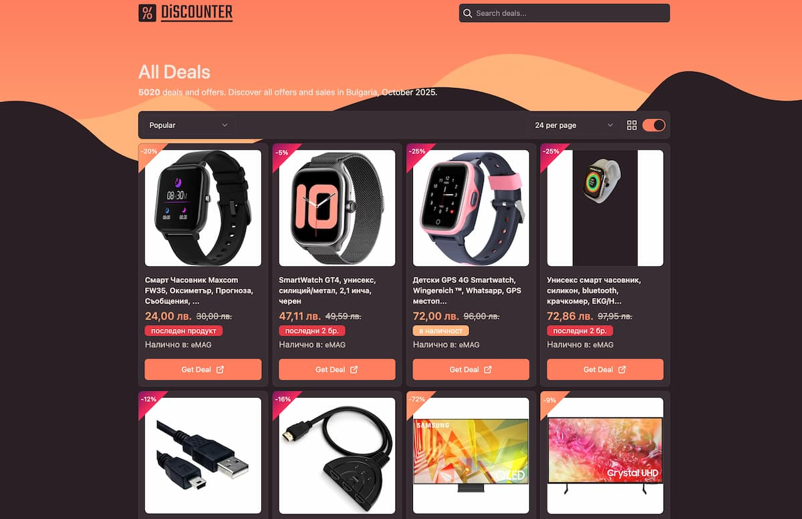

# Discount & Promo Code Aggregator

A web service that aggregates discount deals and promo codes from various sources, using web scraping and real-time data fetching, with caching and optimized data fetching strategies.

## 🚀 Features

- **Product & Category Scraping**: Automatically fetches discount deals from categories on eMAG.
- **Caching with Redis**: Uses Redis for caching scraped data, improving performance and reducing load times for frequently accessed data.
- **Lazy Loading with Skeletons**: Improves performance and UX by displaying skeleton loaders while content is being loaded.
- **SSR with Next.js**: Fetches data on the server-side to improve SEO and initial load speed.
- **Dynamic Routing**: Supports navigation through different categories and product details.
- **Database**: Integrated with MongoDB to store product data and Redis for caching.
- **Responsive UI**: Designed with Shadcn UI & Tailwind CSS for a mobile-friendly and modern interface.
- **Theme Switching**: Swithing between dark & light themes.

## 🛠 Tech Stack

- **Frontend**: Next.js, React, TypeScript, Tailwind CSS
- **Backend**: Node.js, Cheerio/Puppeter (for scraping data), Redis (for caching), MongoDB (for data storage)
- **State Management**: Zustand
- **Design System**: Shadcn UI
- **Animations**: Framer Motion
- **Programming Language**: TypeScript
- **Hosting**: Vercel

## 📂 Project Structure

```
📦 project-root
├── 📂 app             # api routes, layout, pages, etc.
├── 📂 components      # UI components (buttons, cards, loaders, etc.)
├── 📂 hooks           # Custom React hooks
├── 📂 pages           # Next.js pages
├── 📂 models          # Product schemas
├── 📂 public          # Static assets
├── 📂 scripts         # Scraper scripts
├── 📂 styles          # Global & module styles
├── 📂 lib             # Main script functions
├── 📂 utils           # Utility functions
├── 📂 config          # App configuration
└── next.config.js    # Next.js configuration
```

## 🔧 Setup & Installation

1. Clone the repository:
   ```sh
   git clone https://github.com/njordulv/discounter.git
   cd discounter
   ```
2. Install dependencies:
   ```sh
   npm install
   ```
3. Configure environment variables (`.env`):
   ```sh
   MONGODB_URI=your_mongodb_connection_string
   REDIS_URL=your_redis_connection_string
   ```
4. Run the development server:
   ```sh
   npm run dev
   ```

## 🔧 Running Scraper Script

- To run the scraper and save data to MongoDB:
- Use the following command to run the scraper:

  ```sh
  npm run scraper
  ```

- This will scrape the eMAG website, store product data in MongoDB, and use Redis for caching to optimize future data fetching.

5. Open `http://localhost:3000` in your browser.

## 📌 Roadmap

- [ ] Implement a bookmarking system for saving deals
- [ ] Add user notifications for new discounts
- [ ] Improve data fetching performance
- [ ] Enhance accessibility (a11y improvements)

## Screenshot



## 📜 License

Licensed under the [MIT License](LICENSE).

---

### 📬 Contact

For questions or suggestions, reach out to [njordulv@gmail.com](mailto:njordulv@gmail.com).
